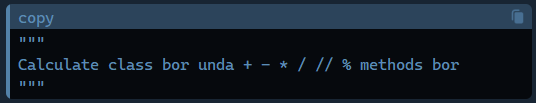
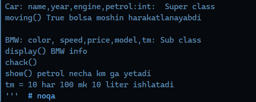

# Algorithms-Part-5

<h2>Task 1</h2>

<h2>Task 3</h2>

<h2>Task 4</h2>

Bu taskda Class yordamida BankAccount class i yaratilgan

<h2>Task 5</h2>

Bu taskda Python ABC (Abstract Base Classes) yordamida abstrakt sinflarni yaratish